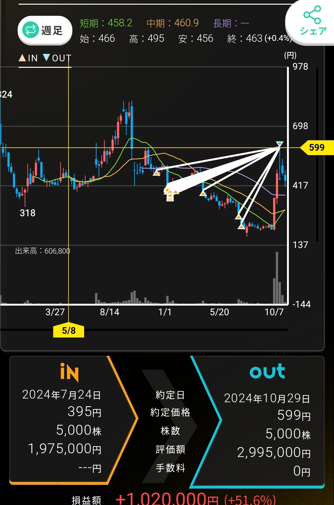

## プラン

```
[ベースフード株価の展望]


ベースフードの2025.2の決算発表が会社予想どおりに運んだ場合、PSR２.5倍を株価に換算すると１株あたり719円    現在400円を割った株価。今後黒字化が見込める場合2倍株になる可能性がある。なお、参考までに青汁のキューサイを買収し、健康食品を扱う「ユーグレナ」のPSRは2.5倍

[ベースフード当面の経営のポイント]
    1. 高い売り上げ成長率を挙げていくこと。展開商品数の拡大や新商品の投入。海外展開、１店舗あたりの売上成長につながるマーケティング施策、ECからの売上、海外展開、利益率を改善する取り組みなどに注目すべき
        ・初期の頃は、時短や効率化を求めるIT界隈の人などが多かった
        ・ここ数年は、よりライトな層に広がってきています
        ・最初はパスタから始まり、パンやクッキー、冷凍食品も発売して、購入者層もだいぶ変わった
        ・自社EC・サブスクリプション（定額課金）中心。パンが売上構成比の9割。
        ・リテールでの販売も広げています。国内のコンビニの配荷率が81%と高水準にある(堅調な成長)
        ・2023年8月末段階で、商品の展開店舗数が4万9252店舗。小売店1店舗当たりの月間売上高: 第1四半期の8800円から9500円、
        ・これを国内のリテール全体の売上に換算すると、1ヶ月に４億。１年間で約50億の計算。
        　・リテールチャネルの四半期別の売上高は2024年2月期 第1四半期の11.9億円から第2四半期は14億円まで成長
        ・2024年2月期の年間売上高予想１５０億の約３分の１が国内リテールでの販売によるもの
        ・残りは、３分の２が自社EC・サブスクリプション（定額課金）か？
        ・シリーズの累計販売数はこの9月に1億5000万袋を突破
        ・中国・米国での販売を開始（海外展開）
        ・香港では半期で10万袋の販売を実現（海外展開）
        ・2023年5月には中国での販売を開始（海外展開）
        ・2023年9月（第3四半期）以降はコロナ前に一度撤退した米国での販売も再開する計画（海外展開）
        
    2. 売上高増に加えさまざまな改善策を実施し、営業損益の黒字化を目指す（株価が公募価格を上回るためには、黒字化が1番の近道。ビジネスモデルを大きく変えない限り、黒字化は難しいとも言われるが？）
        ・製造法の効率化による売上原価率の改善
            ・損益分岐点が高いベースフード 原価率は45.1％
        ・先行投資として強化予定であった人件費計画の見直し
            ・上場前後にR&D人材を多数獲得（2023年11月現在、正社員の40%以上がR&D人材）
        ・販管費率の改善等
    3. 黒字化の妨げになるあらゆるリスクに注意
        ・2023年の商品自主回収と同様の事故の再発防止
        ・燃料費の高騰などによる売上総利益率（の圧迫）の懸念の再浮上
        ・OEM製造委託先工場の生産キャパシティの悪化
            今後の生産キャパシティ 
                ベースフードは、自社工場を持たずにOEMで製造を委託している
                    コロナ禍で微減となったパンの消費量は2021年度以降プラスに転じている？
        ・材料費の高騰などによる売上総利益率（の圧迫）
        ・海外展開での失敗・売上成長率の停滞
        ・食品トレンドの変化・風評被害も含む、期待を下回る国内売上高・売上成長率
        ・コンビニは配荷率が81%と高水準。国内の配荷率の伸びしろは限定的。この手は期待できない。
```

## 結果

- リターン+50%。
- メルコホールディングスの牧社長が10月に大量買い付けを実施し、市場が反応。買い付け理由と出口は不明。大量保有報告されているのは[3銘柄](https://www.buffett-code.com/shareholder/a07176c36912fc9f8c8198dbe67739e2)なので、付加価値を理解されたうえでの応援的投資か？


