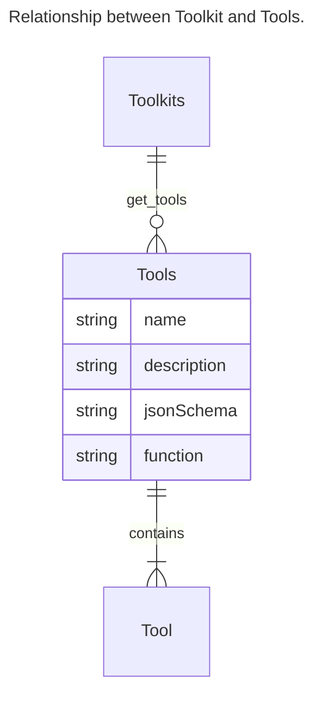

# 2024年3月4日_生成AI_Langchain学習続き_ToolkitとTools

## 時間

- 3/4 20:30-22:12(1h42m)

## やること

- Langchain ToolkitsとToolsの関係性を理解する
- 定義ずみのLangchain Toolkits(integration)をざっと理解する

## 備忘録

- Langchain ToolkitsとToolsの関係性を理解する

### 定義ずみのLangchain Toolkits(integration)

`3/4 Langchainの公式ページに紹介されてるもの全量`

- AINetwork https://python.langchain.com/docs/integrations/toolkits/ainetwork
  - AINetwork Toolkit is a set of tools for interacting with the AINetwork Blockchain. These tools allow you to transfer AIN
- Airbyte Question Answering https://python.langchain.com/docs/integrations/toolkits/airbyte_structured_qa
  - This notebook shows how to do question answering over structured data,

- Amadeus https://python.langchain.com/docs/integrations/toolkits/amadeus
  - Amadeus toolkit allows agents to make decision when it comes to travel, especially searching and booking trips with flights

- Azure Cognitive Services
  - toolkit is used to interact with the Azure Cognitive Services API to achieve some multimodal capabilities
    - four tools bundled in this toolkit:
      - AzureCogsImageAnalysisTool
        - used to extract caption, objects, tags, and text from images.
        - not available on Mac OS yet
      - AzureCogsFormRecognizerTool
        - used to extract text, tables, and key-value pairs from documents. 
      - AzureCogsSpeech2TextTool
        - used to transcribe speech to text
      - AzureCogsText2SpeechTool
        - used to synthesize text to speech.
      - AzureCogsTextAnalyticsHealthTool
        - used to extract healthcare entities
- ClickUp https://python.langchain.com/docs/integrations/toolkits/clickup
  - ClickupToolkit
  - Clickup provides small and large teams across industries with flexible and customizable work management solutions, tools, and functions
ClickUp is an all-in-one productivity platform

- Cogniswitch Tools https://python.langchain.com/docs/integrations/toolkits/cogniswitch
  - Langchain CogniSwitch helps alleviate the stress of decision making when it comes to, choosing the right storage and retrieval formats
  - CogniSwitch to build production ready applications that can consume, organize and retrieve knowledge flawlessly

- Connery Toolkit https://python.langchain.com/docs/integrations/toolkits/connery
  - you can integrate Connery Actions into your LangChain agent
    - Connery is an open-source plugin infrastructure for AI

- CSV https://python.langchain.com/docs/integrations/toolkits/csv
  - agents to interact with data in CSV format
    - It is mostly optimized for question answering
  - This notebook shows how to use agents to interact with data in CSV
    - this agent calls the Pandas DataFrame agent under the hood, which in turn calls the Python agent, which executes LLM generated Python code - this can be bad if the LLM generated Python code is harmful. 

- Document Comparison https://python.langchain.com/docs/integrations/toolkits/document_comparison_toolkit
  - agent to compare two documents

- Github https://python.langchain.com/docs/integrations/toolkits/github
  - Github toolkit contains tools that enable an LLM agent to interact with a github repository.
  - The tool is a wrapper for the PyGitHub library.
The Github toolkit contains tools that enable an LLM agent to interact

- Gitlab https://python.langchain.com/docs/integrations/toolkits/gitlab
  - The Gitlab toolkit contains tools that enable an LLM agent to interact

- Gmail https://python.langchain.com/docs/integrations/toolkits/gmail
  - connecting a LangChain email to the Gmail API
- Jira https://python.langchain.com/docs/integrations/toolkits/jira
  - Jira toolkit allows agents to interact with a given Jira instance
  - the tool wraps the atlassian-python-api library, for more see: https://atlassian-python-api.readthedocs.io/jira.html
- JSON https://python.langchain.com/docs/integrations/toolkits/json
  - agent interacting with large JSON/dict objects. The agent is able to iteratively explore the blob to find what it needs to answer the user’s question.
    - useful when 
      - you want to answer questions about a JSON blob that’s too large to fit in the context window of an LLM.

- MultiOn https://python.langchain.com/docs/integrations/toolkits/multion
  - connecting LangChain to the MultiOn Client in your browser
    - MultiON has built an AI Agent that can interact with a broad array of web services and application
- NASA https://python.langchain.com/docs/integrations/toolkits/nasa
  - agents to interact with the NASA toolkit. The toolkit provides access to the NASA Image and Video Library API, with potential to expand and include other accessible NASA APIs in future iterations.
- Office365 https://python.langchain.com/docs/integrations/toolkits/office365
  - Microsoft 365 is a product family of

- OpenAPI https://python.langchain.com/docs/integrations/toolkits/openapi
  - agents to consume arbitrary APIs, here APIs conformant to the OpenAPI/Swagger specification.
- Natural Language APIs https://python.langchain.com/docs/integrations/toolkits/openapi_nla
  - NLAToolkits) permit LangChain Agents to efficiently plan and combine calls across endpoints
    - sample composition of the Speak, Klarna, and Spoonacluar APIs
- Pandas Dataframe https://python.langchain.com/docs/integrations/toolkits/pandas
  - agents to interact with a Pandas DataFrame. It is mostly optimized for question answering
    - this agent calls the Python agent under the hood, which executes LLM generated Python code - this can be bad if the LLM generated Python code is harmful. Use cautiously

- PlayWright Browser https://python.langchain.com/docs/integrations/toolkits/playwright
  - toolkit is used to interact with the browser. While other tools (like the Requests tools) are fine for static sites, PlayWright Browser toolkits let your agent navigate the web and interact with dynamically rendered sites

- Polygon IO Toolkit https://python.langchain.com/docs/integrations/toolkits/polygon
  - agents to interact with the Polygon IO toolkit. The toolkit provides access to Polygon’s Stock Market Data API.
- PowerBI Dataset https://python.langchain.com/docs/integrations/toolkits/powerbi
  - agent interacting with a Power BI Dataset. The agent is answering more general questions about a dataset, as well as recover from errors
- Python https://python.langchain.com/docs/integrations/toolkits/python
  - agent designed to write and execute Python code to answer a question
- Robocorp https://python.langchain.com/docs/integrations/toolkits/robocorp
  - Robocorp is the easiest way to extend the capabilities of AI agents, assistants and copilots with custom actions.
- Slack https://python.langchain.com/docs/integrations/toolkits/slack
  - connecting LangChain to your Slack account
- Spark Dataframe https://python.langchain.com/docs/integrations/toolkits/spark
  - agents to interact with a Spark DataFrame and Spark Connect. It is mostly optimized for question answering.
- Spark SQL https://python.langchain.com/docs/integrations/toolkits/spark_sql
  - agents to interact with Spark SQL. Similar to SQL Database Agent, it is designed to address general inquiries about Spark SQL and facilitate error recovery
- SQL Database https://python.langchain.com/docs/integrations/toolkits/sql_database
  - agent designed to interact with a SQL databases. The agent builds from SQLDatabaseChain.
    - not found why?: https://python.langchain.com/docs/use_cases/tabular/sqlite
- Steam Game Recommendation & Game Details - https://python.langchain.com/docs/integrations/toolkits/steam
  - Steam toolkit has two tools: - Game Details - Recommended Games 
  - using Steam API with LangChain to retrieve Steam game recommendations based on your current Steam Game Inventory or to gather information regarding some Steam Games which you provide
- Xorbits https://python.langchain.com/docs/integrations/toolkits/xorbits
  - agents to interact with Xorbits Pandas dataframe and Xorbits Numpy ndarray. It is mostly optimized for question answering.

## 次のアクション

- 他にもToolsがないのか調べてみる
- どれか１つだけでもいいから具体的なコードを読んで理解する
- 自分特にやりたいもの、どうでも良いものを選別してみる
